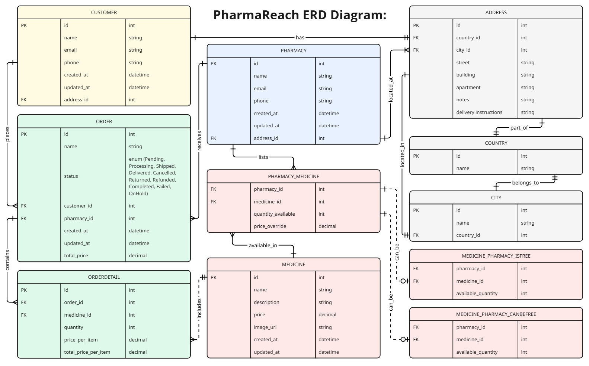

# PharmaReachDB

## Overview
PharmaReachMVC is a web-based application designed to manage healthcare-related operations within the PharmaReach system. It tracks entities such as customers, pharmacies, medicines, and orders, supporting commercial and prepaid transactions. Built on the MVC architecture, it integrates with a SQL Server database to ensure data integrity and scalability.

## Features
- **MVC Architecture**: Separates concerns for better maintainability and scalability.
- **Order Management**: Tracks commercial and prepaid orders with detailed status and information.
- **Pharmacy Integration**: Links pharmacies with prescriptions and medicines.
- **User Authentication**: Secure login and registration for customers and pharmacy staff.

## Database Structure
The database, built with SQL Server, includes entities for customers, pharmacies, medicines, and orders. Entity Framework manages data interaction via a DbContext.

### Key Entities
- **Customers**: Stores customer information and login credentials.
- **Pharmacies**: Manages pharmacy details and licenses.
- **Medicines**: Tracks medicines and their attributes.
- **Orders**: Manages customer orders and transaction details.

## ERD (Entity-Relationship Diagram)
The Entity-Relationship Diagram (ERD) represents the database structure and relationships:

